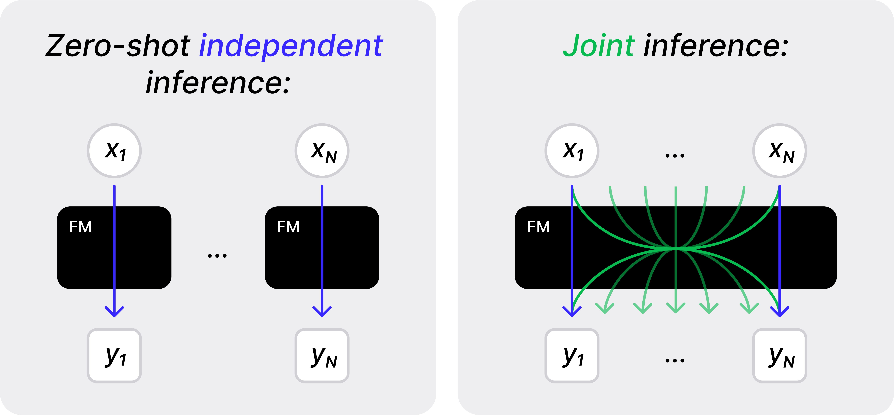

## Large (Vision) Language Models are Unsupervised In-Context Learners

[Artyom Gadetsky*](http://agadetsky.github.io), [Andrei Atanov*](http://andrewatanov.github.io/), [Yulun Jiang*](https://yljblues.github.io), [Zhitong Gao](https://gaozhitong.github.io/), [Ghazal Hosseini Mighan](https://www.linkedin.com/in/ghazal-hosseini-mighan-8b911823a/), [Amir Zamir](https://vilab.epfl.ch/zamir/), [Maria Brbić](https://brbiclab.epfl.ch/team/)

[`Project page`](https://brbiclab.epfl.ch/projects/joint-inference/) | [`Paper`](https://openreview.net/pdf?id=ohJxgRLlLt) | [`BibTeX`](#citing) 
_________________
<div align="justify">
This repo contains the source code of the joint inference framework, a framework for large (vision) language models to perform unsupervised adaptation on a given task, resulting in the improved performance upon independent zero-shot predictions. Our framework is compatible with any existing large (vision) language model and, remarkably, despite being fully unsupervised, it often performs on par with supervised approaches that rely on ground truth labels. For more details please check our paper <a href="https://openreview.net/pdf?id=ohJxgRLlLt">Large (Vision) Language Models are Unsupervised In-Context Learners</a> (ICLR '25).
</div>

</br>
<div align="center" style="padding: 0 100pt">

</div>
</br>
<div align="justify">Unlike the standard zero-shot inference that makes a prediction independently for each input, the joint inference makes predictions for multiple inputs at the same time. Such joint predictions leverage inter-sample dependencies to reason over multiple examples simultaneously and guide the model to make consistent predictions. Performing joint inference requires solving the optimization problem that is intractable for a large number of examples. To address this, we develop approximation techniques, resulting in two unsupervised adaptation methods: Unsupervised Fine-tuning and Unsupervised In-Context Learning.</div>

### Setting Environment Variables
```
export DATA_ROOT=<path to store datasets>
export XDG_CACHE_HOME=<path to store pre-trained models>
export HF_HOME=<path to store pre-trained models>
export HF_TOKEN=<your huggingface token>
```

### Language Experiments

#### Environment Preparation
First, install the required packages for the language experiments by running:

```
pip install -r requirements_llm.txt
pip install flash-attn -U --no-build-isolation
```

#### Unsupervised Fine-tuning
To run unsupervised fine-tuning on close-ended NLP tasks (Table 1 in the paper), you can use `unsupervised_ft_llm.py` script. For example:
```
CUDA_VISIBLE_DEVICES=0 HYDRA_FULL_ERROR=1 python unsupervised_ft_llm.py --config-name llama_sst2.yaml
```

#### Unsupervised In-Context-Learning
Similarly, to run unsupervised in-context learning on close-ended NLP tasks (Table 1 in the paper), you can use `unsupervised_icl_llm.py` script. For example:
```
CUDA_VISIBLE_DEVICES=0 python unsupervised_icl_llm.py --dataset sst2
```

To conduct experiments on the challenging NLP tasks (Table 2 in the paper), use the scripts below.

To run on MMLU:
```
CUDA_VISIBLE_DEVICES=0 python unsupervised_icl_llm_mmlu.py 
```

To run MMLU-pro:
```
CUDA_VISIBLE_DEVICES=0,1,2,3 python unsupervised_icl_llm_mmlu_pro.py
```

To run on GSM8K:
```
CUDA_VISIBLE_DEVICES=0,1,2,3 python unsupervised_icl_llm_gsm8k.py --model Qwen/Qwen2.5-Math-7B
```


### Vision Experiments

#### Environment Preparation
First, install the required packages for the vision experiments by running:

```
pip install -r requirements_vlm.txt
pip install torch==2.1.2 torchvision==0.16.2
```

#### Unsupervised Fine-tuning
To run unsupervised fine-tuning on vision tasks (Table 3 in the paper) you can use `unsupervised_ft_vlm.py` script. For example:
```
CUDA_VISIBLE_DEVICES=0 HYDRA_FULL_ERROR=1 python unsupervised_ft_vlm.py --config-name openflamingo_cifar100_of_lora.yaml
```

#### Unsupervised In-Context-Learning
Similarly, to run unsupervised in-context learning on vision tasks (Table 3 in the paper) you can use `unsupervised_icl_vlm.py` script. For example:
```
CUDA_VISIBLE_DEVICES=0 HYDRA_FULL_ERROR=1 python unsupervised_icl_vlm.py --config-name openflamingo_icl_base template=openflamingo_imageclassification dataset=cifar100_clip_emb labelset=cifar100_openflamingo
```

### Citing

If you find our code useful, please consider citing:

```
@inproceedings{gadetsky2025large,
    title={Large (Vision) Language Models are Unsupervised In-Context Learners},
    author={Artyom Gadetsky and Andrei Atanov and Yulun Jiang and Zhitong Gao and Ghazal Hosseini Mighan and Amir Zamir and Maria Brbic},
    booktitle={International Conference on Learning Representations},
    year={2025},
}
```